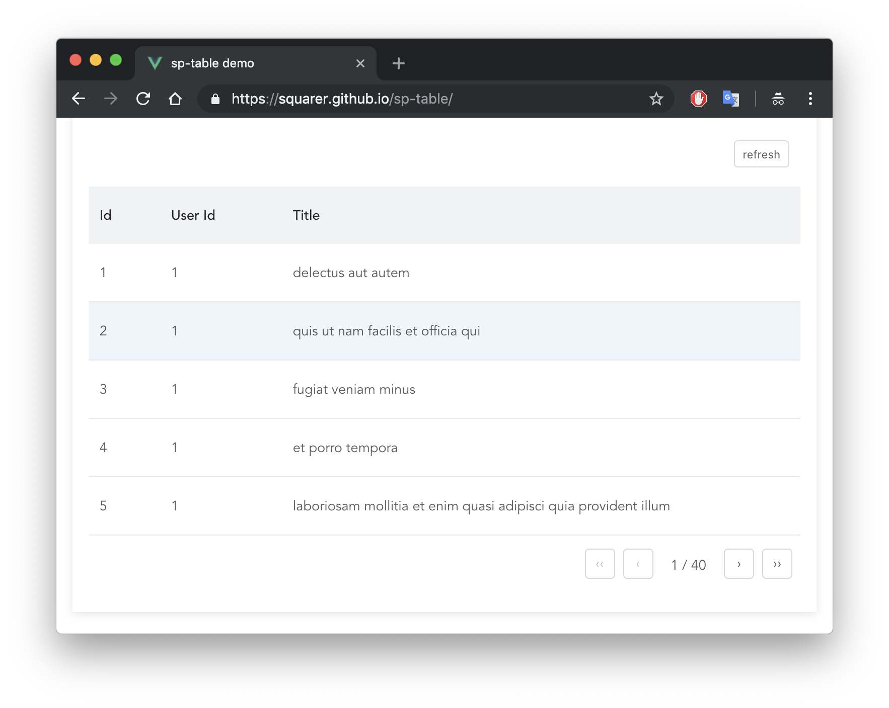

# sp-table

Table component with server-side pagination



## Links
+ [Live Demo](https://squarer.github.io/sp-table/)
+ [JSFiddle](https://jsfiddle.net/squarer/8r9taky3/)

## Installation
### npm
```
npm install --save sp-table
```
### cdn
```
<script src="https://unpkg.com/vue/dist/vue.js"></script>
<script src="https://unpkg.com/sp-table"></script>
```
